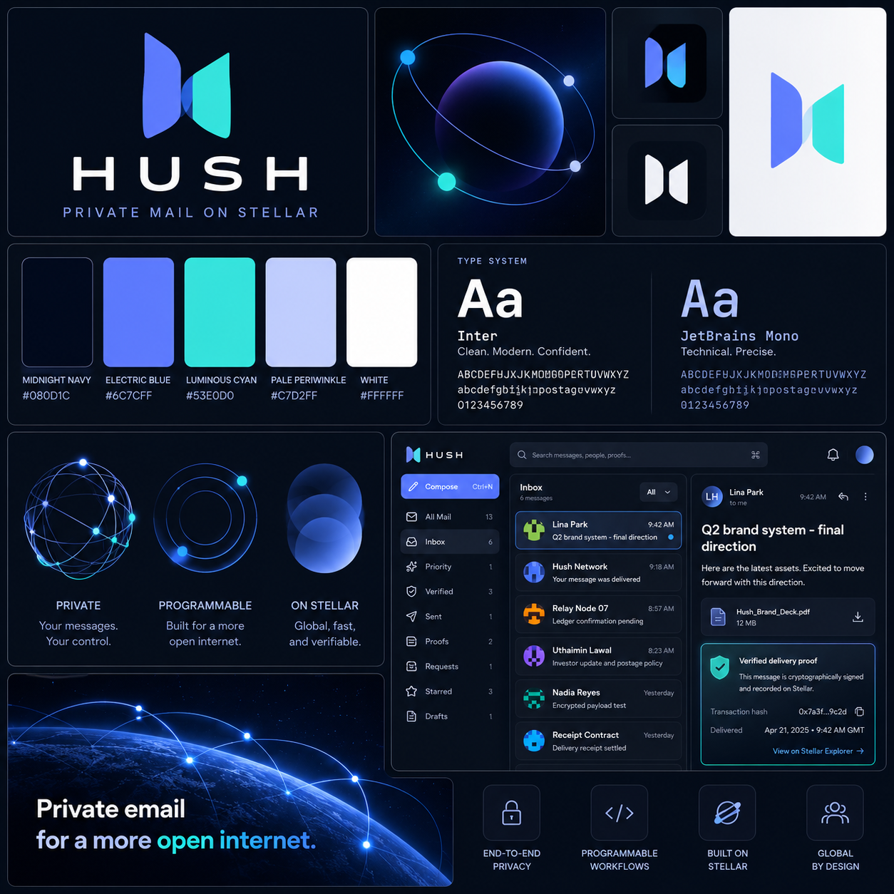

# Hush — Private Mail on Stellar

> **Your inbox. Your rules. Proof for every delivery.**



Hush is private, programmable email built on Stellar. Decide who can reach you, what unknown senders must do first, and which delivery claims you can verify.

Email was built to let anyone enter your inbox. That openness became spam, phishing, impersonation, and a security model held together by domain reputation. Hush starts with a different rule: **access is earned, not assumed.** Trusted people should reach you immediately. Everyone else must satisfy the policy you choose: verified identity, minimum postage, explicit approval, or no access at all.

## Why Hush

- **You control access.** Allow, block, or price unknown senders before they enter your inbox.
- **Identity is verifiable.** Stellar accounts and federation addresses give senders cryptographic identities instead of display-name trust.
- **Spam has a cost.** Optional micro-postage changes bulk abuse from free to economically measurable.
- **Delivery has proof.** Message hashes, postage proofs, and receipts create an auditable delivery trail without putting private message bodies on-chain.
- **Messages stay private.** Encrypted payloads remain off-chain; Stellar anchors identity, policy, payment references, and proof.
- **Safety stays fast.** Stellar's low-cost settlement keeps verification and anti-spam controls practical for everyday mail.

## The Protocol

1. **Resolve identity.** A human-readable Hush address resolves to a Stellar account and encryption keys.
2. **Check mailbox policy.** The sender learns whether they are trusted, blocked, required to verify, or required to attach postage.
3. **Encrypt and send.** The client encrypts the message body and submits it to a relay or recipient-controlled storage.
4. **Anchor the proof.** The message hash and payment reference are recorded without exposing message content.
5. **Verify before rendering.** The client checks sender identity, payload integrity, postage, and delivery state.

API implementers should follow the [signed API authentication protocol v1](docs/security/api-authentication-v1.md)
for canonical requests, required headers, challenge validity, signature verification, replay
protection, error responses, and executable synthetic interoperability vectors.

Hush turns the inbox from an open endpoint into a programmable, privacy-preserving communication boundary.

## Built on Stellar

Stellar gives Hush a public identity and settlement layer while message content stays encrypted off-chain. The Soroban contracts in `contracts/soroban/` cover sender policies, postage, delivery receipts, and message lifecycle events. The client and relay coordinate identity resolution, encryption, admission, delivery, and proof inspection.

Hush is in beta. Testnet and local development paths are available; production readiness depends on the deployment and release gates documented in [`docs/deployment/`](docs/deployment/README.md).

## Explore the project

| Area | Code |
| --- | --- |
| Mail client and product flows | [`src/features/`](src/features/) |
| HTTP API and domain services | [`src/routes/api/v1/`](src/routes/api/v1/) and [`src/server/api/`](src/server/api/) |
| Encryption and message envelopes | [`src/services/crypto/`](src/services/crypto/) and [`protocol/messages/`](protocol/messages/) |
| Relay and encrypted object storage | [`src/services/relay/`](src/services/relay/) and [`src/services/storage/`](src/services/storage/) |
| Stellar adapters and Soroban contracts | [`src/services/stellar/`](src/services/stellar/) and [`contracts/soroban/`](contracts/soroban/) |

## Contributing

Hush is a substantial codebase, so contribution issues should name a clear owner area, a bounded change, acceptance criteria, and the checks needed to verify it. Good starting areas include protocol vectors and documentation, Soroban contract tests, relay interoperability, and mailbox accessibility.

Read [`CONTRIBUTING.md`](CONTRIBUTING.md) before opening a pull request. For maintainer preparation for the Stellar Wave, see [`docs/product/stellar-wave-readiness.md`](docs/product/stellar-wave-readiness.md). Repository participation and issue selection are subject to approval by the [Stellar Wave Program](https://www.drips.network/wave/stellar).

## Run locally

The local brand is Hush. Existing mail domains and protocol identifiers need a coordinated migration; see [`docs/product/brand-migration.md`](docs/product/brand-migration.md).

Requirements: Node.js 24 or newer and Bun 1.3.14.

```sh
bun install
bun run dev
```

Useful checks and focused security commands are listed in [`package.json`](package.json) and the [security verification guide](docs/security/README.md).
