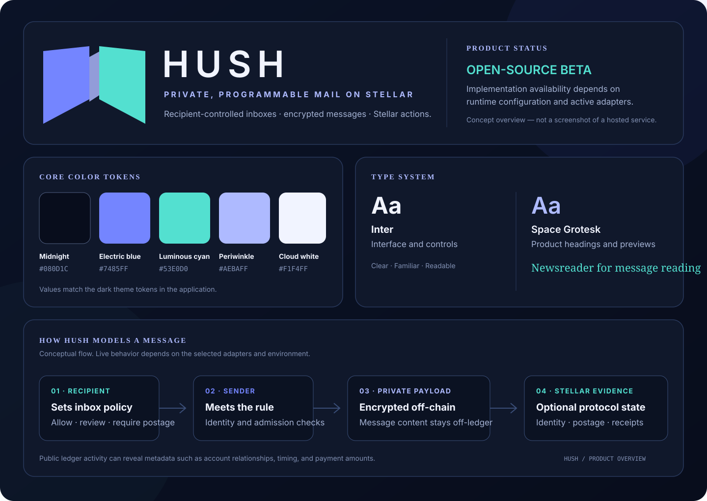
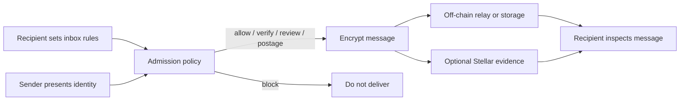

# Hush — your inbox. Your rules. Proof for every delivery.

[](https://github.com/Stellar-hush/hush/actions/workflows/ci.yml)
[](LICENSE)

Hush is a recipient-first mail protocol built on Stellar. It puts inbox policy ahead of delivery, giving people control over who may contact them, what unfamiliar senders must do, and what evidence accompanies a message.

Email made it easy for anyone to reach anyone. That openness also made spam, impersonation, and unwanted contact routine. Hush explores a different model: the recipient sets the rules, senders meet them, and message content stays private while delivery can be verified.



_Recipient-defined access, private message content, and verifiable protocol actions._

## Your inbox, on your terms

Each mailbox owner decides how unfamiliar senders are handled. A sender may be allowed, asked to verify an identity, sent to a review flow, asked for optional postage, or blocked. Trusted people can have a smoother path; unknown senders do not automatically get the same access.

This turns the inbox into a programmable boundary. Instead of sorting every unwanted message after arrival, Hush puts the recipient in control of admission from the start.

## Identity, privacy, and proof

- **Recognizable identity.** Stellar accounts and Hush addresses can provide a verifiable connection between a sender and their signing keys.
- **Recipient-selected admission.** Mailbox rules express how unknown senders should be treated, including verification, review, optional postage, or rejection.
- **Private message content.** Message bodies and attachments are encrypted and carried off-chain. They do not belong in public ledger state.
- **Inspectable delivery evidence.** Hashes, receipts, postage records, and lifecycle events can help participants check what happened without publishing the message itself.
- **A cost for abuse.** Recipient-selected postage adds economic friction to unsolicited bulk contact.

## How a Hush message works

1. **The recipient sets a policy.** The mailbox owner chooses what unfamiliar senders must do.
2. **The sender presents an identity.** A Hush address or Stellar account is resolved to an account and the keys needed by the client.
3. **The policy is evaluated.** The sender follows the applicable path: trusted access, verification, review, postage, or rejection.
4. **The message is encrypted and delivered.** The client prepares an encrypted envelope and submits it through a relay or configured storage service.
5. **Participants inspect the result.** Where the relevant adapters are active, Stellar and Soroban can record identity, postage, receipts, or message lifecycle evidence.



Private message content stays off-chain. Stellar makes identity, policy, postage, and selected delivery actions verifiable.

## Why Stellar

Stellar gives Hush an open identity and settlement layer. Soroban lets the project express programmable policy and protocol actions, while optional postage can make recipient-selected admission rules economically meaningful. Relays and encrypted storage carry the private payload; the chain is used for the parts that benefit from shared verification.

Hush is not a token or yield product. It explores how open identity, recipient choice, and verifiable delivery can work together in communication software.

## Try Hush locally

**Requirements:** Node.js 24 or newer and Bun 1.3.14. Rust is required when building or testing the Soroban contracts; the supported version is pinned in [`rust-toolchain.toml`](rust-toolchain.toml).

```sh
git clone https://github.com/Stellar-hush/hush.git
cd hush
bun install --frozen-lockfile
cp .env.example .env
bun run dev
```

The development server prints its local URL when it starts. Use test accounts and synthetic messages. Never put wallet seeds, private keys, production tokens, or real user mail in `.env`, fixtures, screenshots, logs, issues, or pull requests.

Useful checks:

```sh
bun run format:check
bun run lint
bun x tsc --noEmit
bun run test
bun run build
```

Contract contributors should also run the relevant checks in [`contracts/soroban/`](contracts/soroban/). See [`CONTRIBUTING.md`](CONTRIBUTING.md) for setup and review expectations.

## Explore the project

- [Product walkthrough](docs/product/README.md) — user journeys, product model, and review path.
- [System architecture](docs/architecture/README.md) — components, trust boundaries, and request flow.
- [API guide](docs/api/README.md) — endpoints, authentication, errors, and local examples.
- [Protocol guide](docs/protocol/README.md) — message envelopes, identity, postage, and interoperability.
- [Security overview](docs/security/README.md) — threat model, controls, and privacy boundaries.
- [Deployment guide](docs/deployment/README.md) — runtime configuration, release gates, and verified deployment status.
- [Stellar Wave maintainer brief](docs/product/stellar-wave-readiness.md) — project fit and contribution candidates.

## Contribute

Hush is open source, and focused contributions are welcome. Start with [`CONTRIBUTING.md`](CONTRIBUTING.md), choose an issue with clear acceptance criteria, and include the checks you ran. Good areas include protocol interoperability, Soroban contract behavior, relay reliability, accessibility, and product documentation.

The Stellar Wave maintainer guide explains repository applications and issue selection. Applications require organizer approval; issues should be added to a Wave only after the repository is accepted. See the [maintainer guide](https://docs.drips.network/wave/maintainers/participating-in-a-wave/) and check the [current program page](https://www.drips.network/wave/stellar) for schedule and rules.

## License

Hush is distributed under the [MIT License](LICENSE).
