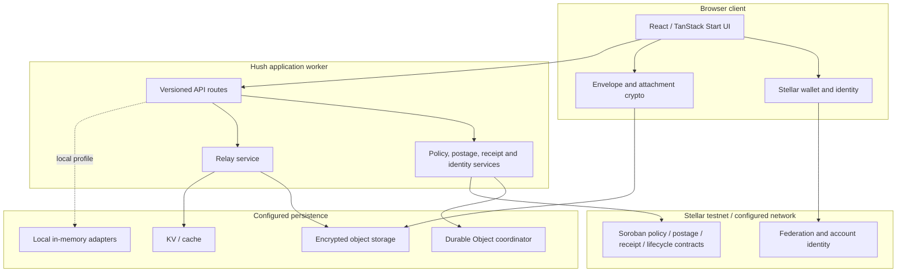

# Hush system architecture

This guide explains the main runtime boundaries and points contributors to the owning modules. It is an orientation map, not a substitute for route contracts, protocol specifications, or deployment manifests. Hush is a beta system; configured adapters determine which paths are active in a given environment.

## System at a glance

The browser prepares user-visible mail actions and cryptographic envelopes. The application worker validates requests and coordinates domain services. Relays and storage carry encrypted payloads. Stellar services and Soroban contracts support identity and protocol state; the exact testnet or production wiring is a deployment concern.

## Trust boundaries

| Boundary           | Responsibility                                                                   | Review questions                                                                                                        |
| ------------------ | -------------------------------------------------------------------------------- | ----------------------------------------------------------------------------------------------------------------------- |
| Browser to API     | Authentication, input validation, CORS, authorization, request limits            | Is the acting account proven by a signed challenge or trusted session? Can caller-supplied identity headers be spoofed? |
| Browser to crypto  | Key use, envelope construction, attachment encryption, local state               | Are secrets and plaintext kept out of logs and telemetry? Are nonce and key lifetimes explicit?                         |
| API to relay       | Admission decisions, authenticated submission, replay protection, delivery state | Are signatures domain-separated and replay checked? Are retries idempotent?                                             |
| Service to storage | Persistence of identity, policy, metadata, and encrypted objects                 | Is the selected adapter durable? Are records backed up, scoped, and retained appropriately?                             |
| Service to Stellar | Contract calls, identity resolution, postage and receipt evidence                | Are network, contract IDs, and passphrase consistent? Are failures and reconciliation handled?                          |
| Ledger visibility  | Public contract events and transactions                                          | Could account relations, timing, payments, or stable IDs reveal more than intended?                                     |

## Request and delivery path

1. The client resolves a sender identity and prepares a recipient, envelope, and request.
2. The API verifies the caller and validates the request schema. Production protected operations require the signed-authentication contract described in [API authentication v1](../security/api-authentication-v1.md).
3. Policy services evaluate the recipient’s current rules and sender relationship.
4. When policy requires it, the client or service obtains and validates postage or approval evidence.
5. The relay accepts the encrypted envelope, persists the supported delivery metadata, and updates protocol state.
6. Receipt and lifecycle services expose the resulting state for recipient verification.

Each step can be disabled, simulated, or backed by a different adapter in local, preview, and production profiles. Read the runtime configuration and deployment docs before assuming an environment has a live chain or persistent store.

## Module map

| Module                  | Owns                                                                               | Start here                                                                    |
| ----------------------- | ---------------------------------------------------------------------------------- | ----------------------------------------------------------------------------- |
| `src/routes/`           | Pages, layouts, route-level loading and HTTP API route handlers                    | `src/routes/index.tsx`, `src/routes/api/v1/`                                  |
| `src/features/`         | User-facing identity, mail, compose, policy, settings, proof, and onboarding flows | Feature-local `README.md` and `INTEGRATION.md` files                          |
| `src/server/api/`       | Request context, authorization, validation, repositories, and domain services      | `src/server/api/README.md` where available; otherwise route and service tests |
| `src/services/crypto/`  | Envelope, key derivation, signatures, recipients, and attachments                  | `ALGORITHM_SUITE.md`, protocol vectors, unit tests                            |
| `src/services/relay/`   | Relay submission, authentication, policy admission, and persistence                | Relay service and transport modules                                           |
| `src/services/stellar/` | Stellar RPC, wallet links, federation, and contract adapters                       | Service modules and `infra/stellar/README.md`                                 |
| `src/services/storage/` | Object and metadata storage abstractions                                           | Storage adapters and tests                                                    |
| `contracts/soroban/`    | Rust Soroban contracts and contract tests                                          | Each contract crate’s README and `Cargo.toml`                                 |
| `protocol/`             | Envelope, federation, key, delivery, and vector specifications                     | [`../protocol/README.md`](../protocol/README.md)                              |

## State and persistence

Local development can use in-memory adapters. Cloudflare deployments declare KV, R2, and a Durable Object coordinator in `wrangler.jsonc`; environment IDs are injected during deployment and should not be committed. A local build or successful contract test does not prove that a deployed Worker has the intended bindings or that persistent data has migrated.

Persisted browser keys, database records, Cloudflare Durable Object class names, and contract identifiers may be compatibility surfaces. Review [brand migration](../product/brand-migration.md) and [schema migration guidance](../deployment/MIGRATIONS.md) before changing them.

## Configuration profiles

- **Development:** local UI and development adapters; synthetic identities and data are expected.
- **Test:** isolated automated checks with deterministic fixtures.
- **Preview:** isolated hosted validation with no production secrets or data.
- **Production:** requires explicit secrets, durable resources, approved origins, release gates, backups, and operator runbooks.

Many runtime names still have the legacy `STEALTH_` prefix because they are coupled to deployment configuration. Treat those as compatibility identifiers until a documented configuration migration is completed.

## Design rules for changes

- Keep protocol parsing and validation at service boundaries; do not trust browser data just because the UI produced it.
- Keep message content out of public ledger records, logs, fixtures, screenshots, and telemetry.
- Use small interfaces for adapters so local tests do not require real wallets, RPC keys, SMTP credentials, or production services.
- Make writes retry-safe where the client or provider can retry; document idempotency scope and expiry.
- Update protocol docs and interoperability vectors whenever wire behavior changes.
- Add migration and rollback notes before changing persisted structures or deployed resource bindings.

## Related guides

- [Root README](../../README.md) — product overview and quick start.
- [API guide](../api/README.md) — HTTP surface and authentication behavior.
- [Protocol guide](../protocol/README.md) — wire formats and compatibility.
- [Security overview](../security/README.md) — threats, controls, and residual risk.
- [Deployment guide](../deployment/README.md) — environments, release gates, and current deployment state.
- [Contributor guide](../../CONTRIBUTING.md) — workflow, tools, and review requirements.
